# CarmNote TNA

> **Reference:** Saqr, M., & López-Pernas, S. (2026). *CarmNote: A Portable,
> Reproducible, Single-File Computational Software Purely in JavaScript.*
> The 26th International Symposium on Computers in Education (SIIE 2026).

**A portable, reproducible, single-file computational software for Transition
Network Analysis**

[**Mohammed Saqr**](https://saqr.me) — Professor of Learning Analytics and
Artificial Intelligence, University of Eastern Finland ·
[**Sonsoles López-Pernas**](https://sonsoles.me) — Associate Professor,
University of Eastern Finland

CarmNote TNA is a self-contained JavaScript implementation of Transition
Network Analysis (TNA) and its higher-order extensions delivered as a single
HTML document. The software integrates computation, visualisation, user
interaction, and analysis-state persistence within a single executable file
that requires neither internet connectivity nor server-side infrastructure.
All computation executes locally within the browser, allowing analyses to be
created, distributed, reproduced, and preserved without external dependencies,
software installation, or environment reconstruction.

This repository distributes the compiled software only. Every file under
[`versions/`](./versions/) is the complete software: download one file, open
it in a web browser, load a CSV or TSV of sequence data, and analyse. Nothing
is installed and no data leave the machine. The current build is
[`index.html`](./index.html); the table at the end of this page lists every
published version with its checksum.

## In Depth

CarmNote TNA is a reactive notebook for sequential and process data. Build
first-order transition networks, fit **higher-order Markov models**, detect
path anomalies against the **hypergeometric null**, compute **simplicial
complexes** with their topological summaries, mine recurring sequential
patterns, and validate every claim with bootstrap and permutation tests —
eight methodological families and twenty-five named procedures. Every method
is a notebook cell: configured inline with named arguments, executed on
demand, and exportable as a table or vector graphic. Results are paginated
and persist across browser refreshes, and the notebook itself saves as a
single self-contained HTML report, so the analysis you hand over is the
analysis that ran.

It is research software you can give a colleague without a setup guide, a
Conda environment, or a list of system prerequisites. The notebook is one
file and the file is the whole program:

- **No installation.** Save the file and open it — that is the entire setup.
- **No prior software.** Python, R, Conda, pip, Node — none of them need to
  be on the computer first. Everything the notebook needs is already inside it.
- **No admin rights.** The notebook opens the way any ordinary document does.
- **No internet.** It works the same way online and offline; nothing is
  fetched and nothing is sent.
- **No compiler.** No Xcode, Rtools, or build tools — there is nothing to
  assemble before it runs.
- **No server.** Nothing runs in the background and nothing communicates
  with another computer. The whole program is the page you have open.
- **No extra files.** One file; there is no folder of supporting material to
  keep alongside it.
- **No system-specific version.** The same file works on Mac, Windows,
  Linux, iPhone, Android, and Chromebook.
- **No desktop required.** The notebook is usable on a phone or a tablet,
  not only on a computer.

The analytical surface covers what a typical transition-network study would
normally assemble from several R and Python libraries — `tna`, `Nestimate`,
`TraMineR`, `igraph`, `qgraph`, `bootnet`, and `cluster` on the R side;
`pathpy`, `networkx`, `scikit-learn`, `statsmodels`, and `scipy` on the
Python side. The higher-order Markov family is numerically equivalent to its
R reference implementation; the remaining methods reproduce the canonical
implementations from those ecosystems.

## Gallery

A sample of CarmNote TNA output — scroll horizontally.

<table>
  <tr>
    <td>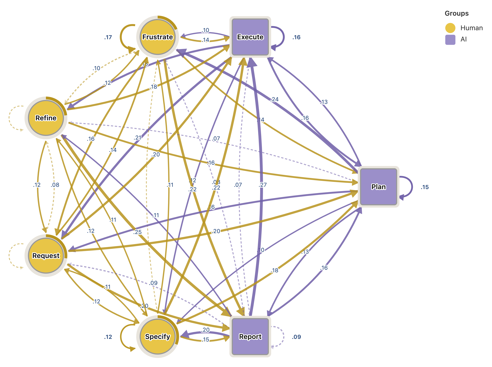</td>
    <td>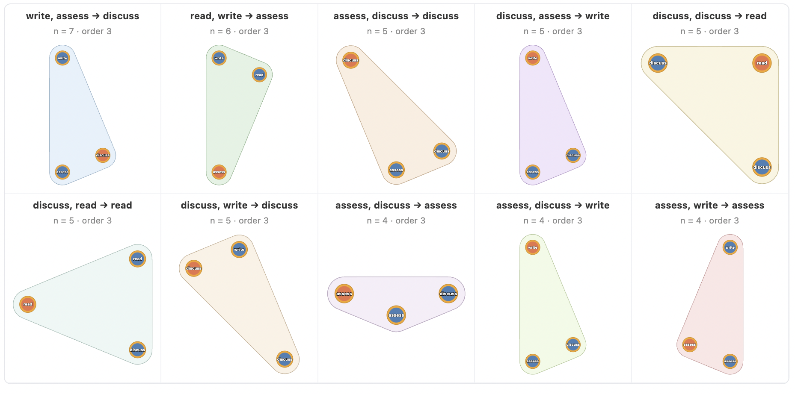</td>
    <td>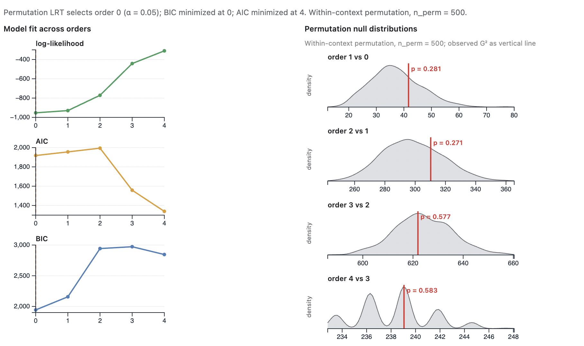</td>
    <td>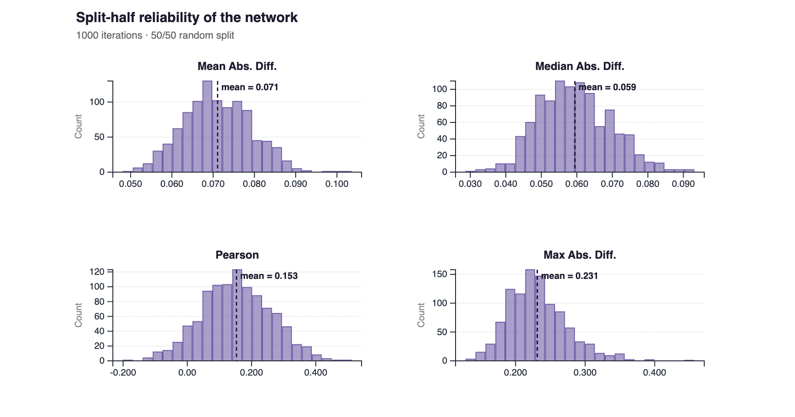</td>
    <td>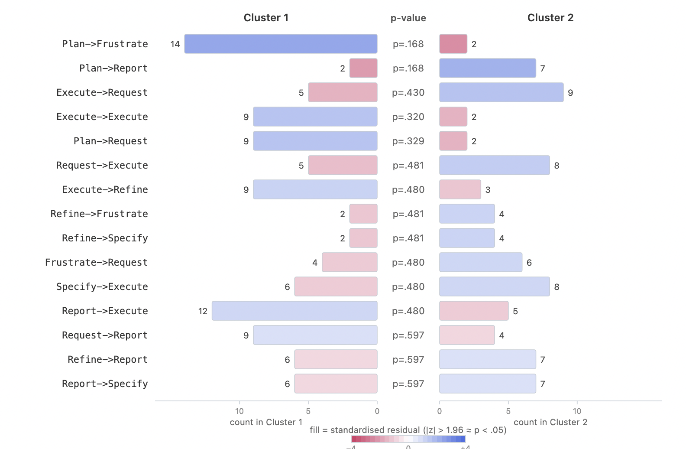</td>
    <td>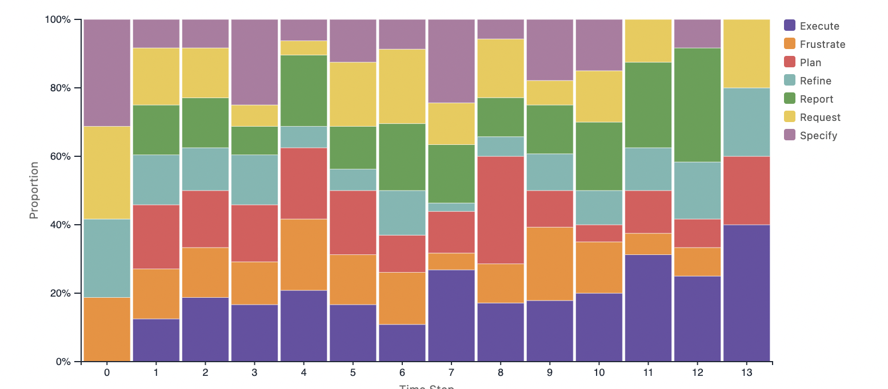</td>
    <td>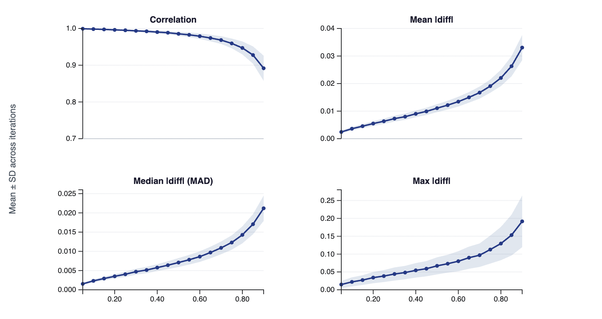</td>
    <td>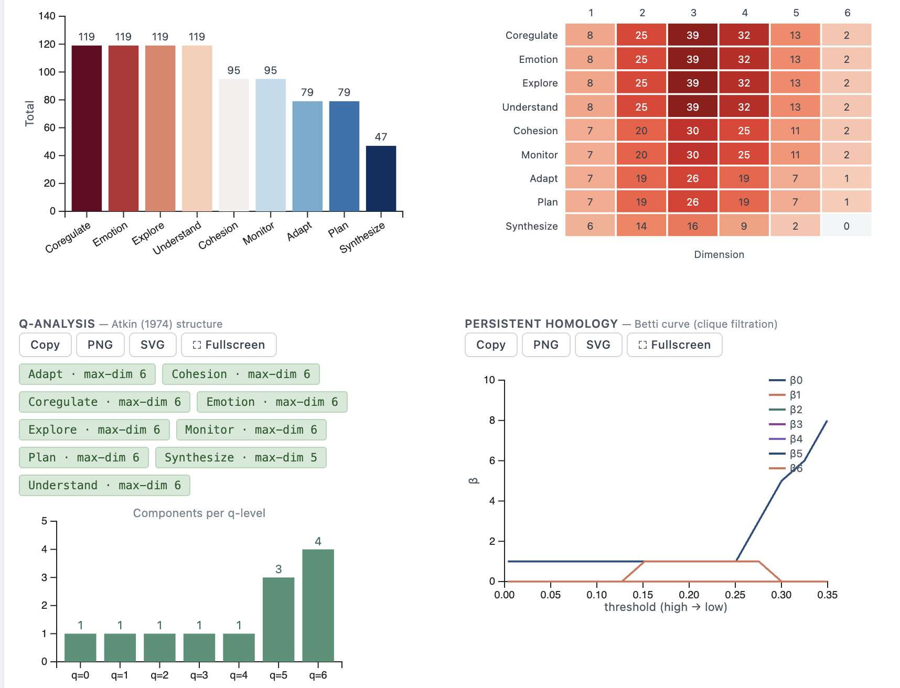</td>
    <td>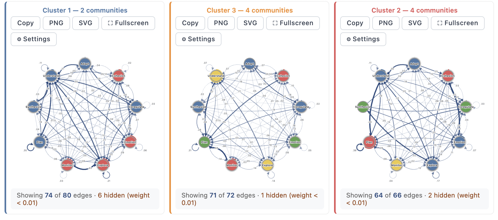</td>
    <td>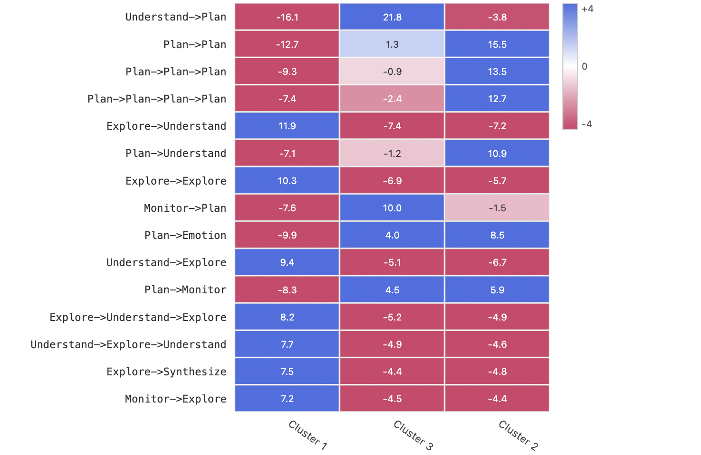</td>
    <td>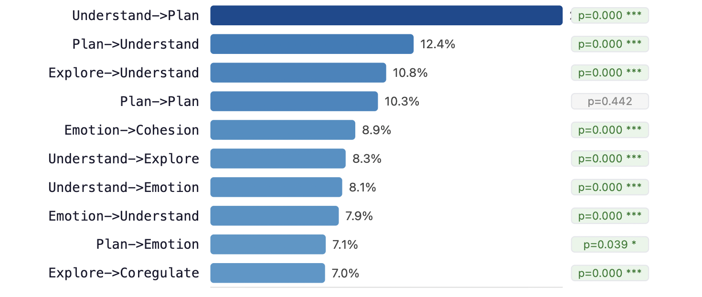</td>
    <td>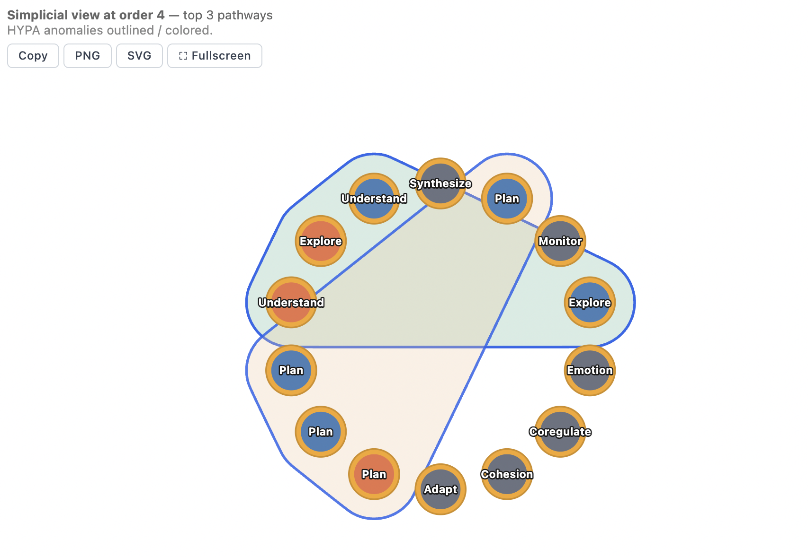</td>
  </tr>
  <tr>
    <td align="center"><em>Grouped transition network (Human vs AI)</em></td>
    <td align="center"><em>Higher-order pathways (order 3)</em></td>
    <td align="center"><em>Markov order test with permutation LRT</em></td>
    <td align="center"><em>Split-half reliability</em></td>
    <td align="center"><em>Cluster comparison with permutation tests</em></td>
    <td align="center"><em>State distribution over time</em></td>
    <td align="center"><em>Case-dropping stability diagnostics</em></td>
    <td align="center"><em>Q-analysis and persistent homology</em></td>
    <td align="center"><em>Cluster transition networks</em></td>
    <td align="center"><em>Cluster pathway residuals</em></td>
    <td align="center"><em>Significant transition patterns</em></td>
    <td align="center"><em>Simplicial HYPA pathways</em></td>
  </tr>
</table>

## Design

CarmNote belongs to the family of Carm software and stands for **Contained**,
**Architecture**-driven, **Runnable**, and **Model**-based design. Contained
refers to the integration of code, interface, visualisations, data, and
results within a single self-sufficient artefact, so that distribution,
execution, and preservation are unified. Architecture-driven refers to the
fact that guarantees such as reproducibility and confidentiality arise from
structural design rather than external policy or user behaviour. Runnable
refers to execution directly within a standard web browser without
installation, configuration, or elevated privileges. Model-based refers to
the embedding of the complete analytical model — data, parameters,
procedures, and outputs — within the same file, so that the analysis can be
inspected, executed, and reproduced as a single unit.

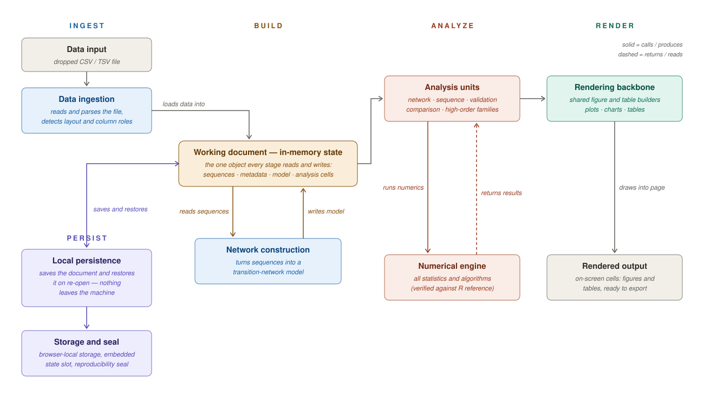

Because the whole workflow lives in one file, an analysis can be initiated by
one researcher, extended by another, and redistributed without any shared
computational environment or software stack. Each saved file preserves the
complete analytical state, allowing subsequent users to resume work directly
from the last computed configuration, modify parameters, extend the analysis,
and re-export the updated artefact. All data remain on the client side,
loaded into local memory and processed by the browser's native JavaScript
runtime, which ensures that sensitive data never leave the user's device.

CarmNote TNA is part of [**Dynalytics**](https://dynasite.org/) — an
overarching framework and methodological ecosystem for the analysis and
rigorous validation of the dynamics of dynamical systems. Dynalytics
encompasses a diverse family of models — transition networks, co-occurrence
networks, psychological networks, and higher-order networks — unified by a
single philosophy of scientific rigour, in which analysis and validation are
inseparable: a multi-level confirmatory testing battery validates every
supported model and every analytical claim, through split-half reliability
for internal consistency, bootstrapping for edge-level stability,
case-dropping for centrality stability, and permutation-based comparisons
for groups, conditions, and temporal phases.

---

## Functions and Analytical Workflow

CarmNote TNA features a full end-to-end numerical stack written in pure JavaScript, handling matrix algebra, network topologies, and sequence mathematics directly within the client-side environment.

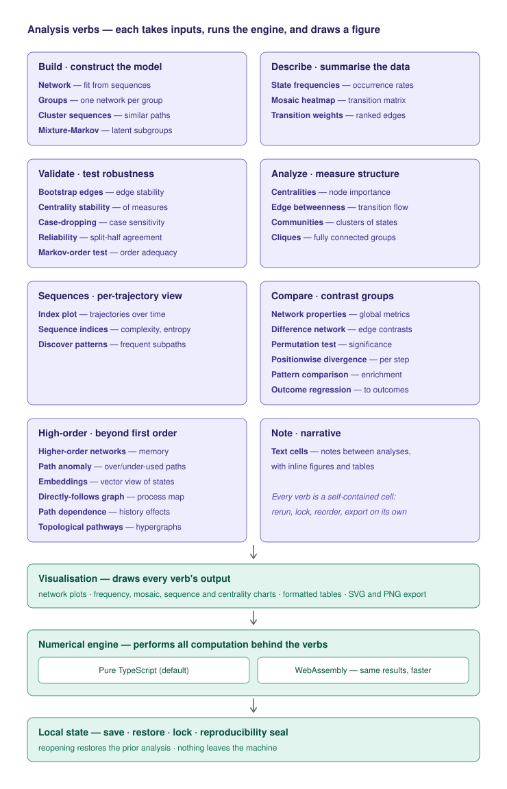

### Network Analysis & Community Structure

* **Centrality Metrics:** Includes calculations for degree, betweenness, closeness, and eigenvector centrality.
* **Advanced Centralities:** Supports stationary-distribution centrality (PageRank form), randomized shortest-path betweenness, and diffusion centrality.
* **Algorithmic Framework:** Employs Brandes’ algorithm for computing betweenness centrality and Bron–Kerbosch backtracking with pivoting for maximal-clique enumeration.
* **Community Detection:** Evaluates complex network groupings using multiple community detection algorithms powered by modularity optimization routines.

### Sequence Analysis & Pattern Discovery

* **Sequence-Level Indices:** Computes established sequence metrics including transition rate, state diversity, normalized entropy, complexity, turbulence, and spell-duration statistics.
* **Pattern Discovery:** Provides contiguous and gapped sequence mining architectures.
* **Group Testing:** Executes permutation-based group comparisons for discovered sequential patterns using chi-square tests integrated with Benjamini–Hochberg multiple-testing corrections.

### Higher-Order Modelling & Topology

* **Markov Frameworks:** Implements higher-order Markov networks, parameter-free higher-order refinements, and higher-order embeddings.
* **Anomaly & Order Testing:** Conducts hypergeometric path-anomaly detection, multi-order graphical modeling, and likelihood-ratio tests for evaluating Markov order correctness.
* **Topological Summaries:** Extracts algebraic and topological data from clique complexes, providing face vectors, Euler characteristics, and Betti numbers.

### Statistical Validation & Outcome Modelling

* **Robust Validation:** Integrates block bootstrap confidence intervals, case-dropping stability analysis, permutation-based group comparisons, and edge reliability estimations.
* **Group Network Comparisons:** Supports stratified network construction and formal, structured network comparison tests.
* **Outcome Predictive Modeling:** Computes odds-ratio analysis and runs multivariable logistic regression using iteratively reweighted least squares. Statistical significance is managed via Benjamini–Hochberg or Holm multiple-testing corrections.

### Core Numerical Implementation

* **Native Linear Algebra:** Operates on an internal, explicitly defined numerical stack for basic matrix calculations, bypassing external Fortran or C library requirements.
* **Eigen Decomposition:** Stationary distribution estimations, Kemeny–Snell fundamental matrices, and higher-order embeddings are powered natively by power iteration and Jacobi-based eigen decomposition.
* **Exact Integer Algebra:** Employs fraction-free elimination when processing sparse graph structures and Betti numbers to eliminate rounding artifacts and preserve exact structures.
* **Stable Statistical Functions:** Special statistical test probabilities rely on series expansions, continued fractions, and stable log-space recurrences using log-Gamma as a shared numerical foundation.
* **Stochastic Control:** Manages all probabilistic and stochastic algorithms using a single, seeded pseudo-random number generator.
* **State Persistence:** Implements robust workspace caching through the browser’s local storage layer using isolated, specific keys for the overall notebook library, the active notebook workspace, and distinct document states.

---

## Equivalence to Existing Software

To ensure numerical correctness, CarmNote TNA underwent cross-language verification against the reference R implementation for higher-order Markov analysis:

* **Rigorous Testing:** An equivalence framework evaluated 8 method families across 36 parameterised cases, encompassing roughly 5,000 atomic field comparisons and over 27,000 additional simulated dataset comparisons.
* **Stochastic Identity:** Exact reproducibility for random-number generation was accomplished by index replay, where streams generated by R were injected into the JavaScript client sandbox.
* **Precision Limits:** Across all test profiles, the tool matched the R reference to the order of 10⁻¹⁷, which is well below the double-precision machine epsilon boundary of 2.2 × 10⁻¹⁶.

---

## Technical Appendix: Core Algorithms

The following table summarizes the mathematical and algorithmic framework implemented inside the pure JavaScript runtime environment of CarmNote TNA:

| Functional Category | Core Algorithms / Methods | Mathematical Foundations |
| --- | --- | --- |
| **Linear Algebra** | Power iteration, Jacobi-based eigen decomposition | Stationary distribution estimation, Kemeny–Snell fundamental matrices, higher-order embeddings |
| **Sparse Graph Structures** | Fraction-free elimination | Exact integer structure preservation, Betti number calculations |
| **Statistical Special Functions** | Series expansions, continued fractions, stable log-space recurrences | Chi-square tail probabilities, hypergeometric distributions via log-Gamma base |
| **Graph-Theoretic Routines** | Brandes’ algorithm, Bron–Kerbosch backtracking with pivoting | Betweenness centrality, modularity optimization, maximal-clique enumeration |
| **Stochastic Procedures** | Single seeded pseudo-random generator with index replay | Exact cross-language reproducibility and computational identity matching |
| **Persistence Layer** | Browser local storage API | Segmented state isolation for notebook libraries, active workspaces, and active documents |

---

## Citation

If CarmNote TNA supports your published work, please cite the software
paper:

> Saqr, M., & López-Pernas, S. (2026). *CarmNote: A Portable, Reproducible,
> Single-File Computational Software Purely in JavaScript.* The 26th
> International Symposium on Computers in Education (SIIE 2026).

```bibtex
@inproceedings{saqr2026carmnote,
  author    = {Saqr, Mohammed and L{\'o}pez-Pernas, Sonsoles},
  title     = {{CarmNote}: A Portable, Reproducible, Single-File
               Computational Software Purely in {JavaScript}},
  booktitle = {The 26th International Symposium on Computers
               in Education (SIIE 2026)},
  year      = {2026}
}
```

To reference the software itself, cite the version you actually ran —
update the `version` field to match the file you used (the repository URL
is stable):

```bibtex
@software{carmnote_tna,
  author  = {Saqr, Mohammed and L{\'o}pez-Pernas, Sonsoles},
  title   = {{CarmNote TNA}: A Portable, Reproducible, Single-File
             Software for Transition Network Analysis},
  year    = {2026},
  version = {2.3.68},
  url     = {https://github.com/mohsaqr/CarmNote-TNA},
  note    = {Numerically equivalent to the R reference implementations
             for the higher-order Markov family.}
}
```

---

## Variants

Each version is published in two computationally equivalent variants,
distinguished by the final engine letter in the filename. The `j` variant
implements the entire numerical engine in pure
TypeScript-compiled JavaScript and is the default — it is the smaller file
and the one `index.html` points to. The `w` variant accelerates the
computational kernels with WebAssembly and is preferable for large datasets.
Files containing `-min-` are minified builds of the same variants.

## Releases

Released payloads are immutable: the checksummed bytes are never altered.
Asset names and links follow the current public naming convention. Downloads
can be verified against the SHA-256 checksums below.

<!-- releases:begin -->
| Version | Date | File | Size | SHA-256 |
|---|---|---|---|---|
| 2.3.69 | 2026-08-24 | [tna-notebook_V2.3.69-full-j.html](./versions/tna-notebook_V2.3.69-full-j.html) | 1.21 MB | `a9443da310dffee483d20bce6f7af862b7c6bff270effbbce2e36dea02041ffe` |
| 2.3.69 | 2026-08-24 | [tna-notebook_V2.3.69-full-w.html](./versions/tna-notebook_V2.3.69-full-w.html) | 1.88 MB | `a47e88674460c27ec90b6d4229c205a78d0fa2393a2998119f7f7fc87342a6d9` |
| 2.3.69 | 2026-08-24 | [tna-notebook_V2.3.69-min-j.html](./versions/tna-notebook_V2.3.69-min-j.html) | 0.88 MB | `48c446c77a2ed3df52482775c3e5167e707d7c9569c57225cd064bf8385e8600` |
| 2.3.69 | 2026-08-24 | [tna-notebook_V2.3.69-min-w.html](./versions/tna-notebook_V2.3.69-min-w.html) | 1.56 MB | `b91a0c7000a146f2f05aeb4b734bae4b4ec88030e9c8db801d2493e933e0abc7` |
| 2.3.68 | 2026-08-12 | [tna-notebook_V2.3.68-full-j.html](./versions/tna-notebook_V2.3.68-full-j.html) | 1.18 MB | `a55f7f86a9d20f453b2d170fd88bc0813130e8fe6e233504aef3316f5e5b8c3a` |
| 2.3.68 | 2026-08-12 | [tna-notebook_V2.3.68-full-w.html](./versions/tna-notebook_V2.3.68-full-w.html) | 1.85 MB | `55d7a61fa9151cc9d7a340e78f7c49adeb9f883d8430bd28433aaf8578237e00` |
| 2.3.68 | 2026-08-12 | [tna-notebook_V2.3.68-min-j.html](./versions/tna-notebook_V2.3.68-min-j.html) | 0.86 MB | `de98e2f88a8619091ceecedf43c672b90d4de2402994b0c3bd19b88525302ace` |
| 2.3.68 | 2026-08-12 | [tna-notebook_V2.3.68-min-w.html](./versions/tna-notebook_V2.3.68-min-w.html) | 1.53 MB | `ca51e07bc0f30246b2338407374f1d28d47a190d2c912f8429131a63b2e00535` |
| 2.3.67 | 2026-08-12 | [tna-notebook_V2.3.67-full-j.html](./versions/tna-notebook_V2.3.67-full-j.html) | 1.18 MB | `0bc29c96d5958721e93234e7304d37b3061c49203b26268d6194d4bf17d335da` |
| 2.3.67 | 2026-08-12 | [tna-notebook_V2.3.67-full-w.html](./versions/tna-notebook_V2.3.67-full-w.html) | 1.85 MB | `ef40e0b1411a3b8cdda31a78caa77bae25cc545fbd65197b4bed95b051ff2a97` |
| 2.3.67 | 2026-08-12 | [tna-notebook_V2.3.67-min-j.html](./versions/tna-notebook_V2.3.67-min-j.html) | 0.86 MB | `57bae53f2eee609c35769aaa16df206546caffb5faca9153feb9e12688433b99` |
| 2.3.67 | 2026-08-12 | [tna-notebook_V2.3.67-min-w.html](./versions/tna-notebook_V2.3.67-min-w.html) | 1.53 MB | `0ba93e32abfe1729134b5cb6c0b3b451f1936d65198ddbcea8c1dff794715d47` |
| 2.3.66 | 2026-08-11 | [tna-notebook_V2.3.66-full-j.html](./versions/tna-notebook_V2.3.66-full-j.html) | 1.18 MB | `2625e7a30283cc9339640bdb63d8f588774bfd8a6ae9ade9181855eafd53409c` |
| 2.3.66 | 2026-08-11 | [tna-notebook_V2.3.66-full-w.html](./versions/tna-notebook_V2.3.66-full-w.html) | 1.85 MB | `b6684c4114069a909a2551a82369574178c8846eeaea40c6511b7a6ae2ab4a01` |
| 2.3.66 | 2026-08-11 | [tna-notebook_V2.3.66-min-j.html](./versions/tna-notebook_V2.3.66-min-j.html) | 0.86 MB | `158102395e86d5547f3be4f8847333405d37e2afed1add4fd417adb2e5dedd07` |
| 2.3.66 | 2026-08-11 | [tna-notebook_V2.3.66-min-w.html](./versions/tna-notebook_V2.3.66-min-w.html) | 1.53 MB | `a9a1f76ae5f33058eff19680f729bbdb93d49726906f37535b99a41238462c75` |
| 2.3.64 | 2026-07-14 | [tna-notebook_V2.3.64-full-j.html](./versions/tna-notebook_V2.3.64-full-j.html) | 1.09 MB | `00844f48d54ebb25d2e54934800a73d7fbba68931468930ea44f8642d0f23bfe` |
| 2.3.64 | 2026-07-14 | [tna-notebook_V2.3.64-full-w.html](./versions/tna-notebook_V2.3.64-full-w.html) | 1.77 MB | `a2be7d1bf0201477ed77f681219d5049a505f5d93208894b89aa09f6577c6bb5` |
| 2.3.64 | 2026-07-14 | [tna-notebook_V2.3.64-min-j.html](./versions/tna-notebook_V2.3.64-min-j.html) | 0.78 MB | `66bec055320f4ec55f533eca43d2b16b7c034bbf0beab400b281008c82af9b3b` |
| 2.3.64 | 2026-07-14 | [tna-notebook_V2.3.64-min-w.html](./versions/tna-notebook_V2.3.64-min-w.html) | 1.46 MB | `68f07bb9144fc6b2260f68e260b1e2dd0991e99e723126f7b4dad7ee668070f4` |
| 2.3.63 | 2026-07-12 | [tna-notebook_V2.3.63-full-j.html](./versions/tna-notebook_V2.3.63-full-j.html) | 1.08 MB | `3ecce4d8f5116b34d1714c028057c00fa3def8d5c3a34412fe03a83bbb3d6809` |
| 2.3.63 | 2026-07-12 | [tna-notebook_V2.3.63-full-w.html](./versions/tna-notebook_V2.3.63-full-w.html) | 1.76 MB | `c8f78222f73f42fc6d5a1525b09a8f154b1f86b22874abfcd4e9e5b286dd5648` |
| 2.3.63 | 2026-07-12 | [tna-notebook_V2.3.63-min-j.html](./versions/tna-notebook_V2.3.63-min-j.html) | 0.78 MB | `988a2f10e207abdad316f359b6d196692bcf051624bbf7812ab5667276bd7cb3` |
| 2.3.63 | 2026-07-12 | [tna-notebook_V2.3.63-min-w.html](./versions/tna-notebook_V2.3.63-min-w.html) | 1.46 MB | `5acd013ad05649a22c95b50a4ce548f5af49bf13b8abd5d1884ea392c4b90e6e` |
<!-- releases:end -->
