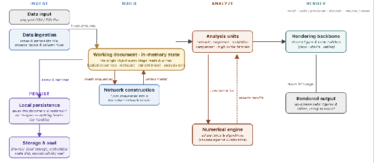
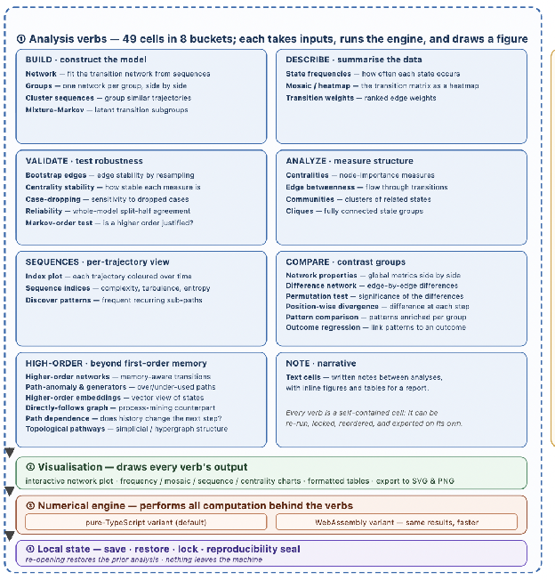

# CarmNote TNA

**A portable, reproducible, single-file computational software for Transition
Network Analysis**

Mohammed Saqr · Sonsoles López-Pernas

CarmNote TNA is a self-contained JavaScript implementation of Transition
Network Analysis (TNA) and its higher-order extensions delivered as a single
HTML document. The software integrates computation, visualisation, user
interaction, and analysis-state persistence within a single executable file
that requires neither internet connectivity nor server-side infrastructure.
All computation executes locally within the browser, allowing analyses to be
created, distributed, reproduced, and preserved without external dependencies,
software installation, or environment reconstruction.

This repository distributes the compiled software only. Every file under
[`versions/`](./versions/) is the complete software: download one file, open
it in a web browser, load a CSV or TSV of sequence data, and analyse. Nothing
is installed and no data leave the machine. The current build is
[`index.html`](./index.html); the table at the end of this page lists every
published version with its checksum.

## Design

CarmNote belongs to the family of Carm software and stands for **Contained**,
**Architecture**-driven, **Runnable**, and **Model**-based design. Contained
refers to the integration of code, interface, visualisations, data, and
results within a single self-sufficient artefact, so that distribution,
execution, and preservation are unified. Architecture-driven refers to the
fact that guarantees such as reproducibility and confidentiality arise from
structural design rather than external policy or user behaviour. Runnable
refers to execution directly within a standard web browser without
installation, configuration, or elevated privileges. Model-based refers to
the embedding of the complete analytical model — data, parameters,
procedures, and outputs — within the same file, so that the analysis can be
inspected, executed, and reproduced as a single unit.

Because the whole workflow lives in one file, an analysis can be initiated by
one researcher, extended by another, and redistributed without any shared
computational environment or software stack. Each saved file preserves the
complete analytical state, allowing subsequent users to resume work directly
from the last computed configuration, modify parameters, extend the analysis,
and re-export the updated artefact. All data remain on the client side,
loaded into local memory and processed by the browser's native JavaScript
runtime, which ensures that sensitive data never leave the user's device.

## Functions

CarmNote TNA implements a full Transition Network Analysis workflow with all
model types, pruning, and validation. Validation procedures include block
bootstrap confidence intervals, case-dropping stability analysis,
permutation-based group comparisons, and edge reliability estimation. Outcome
modelling includes odds-ratio analysis and multivariable logistic regression
via iteratively reweighted least squares, with multiple-testing correction
(Benjamini–Hochberg or Holm). Group comparison supports stratified network
construction and formal network comparison tests.

Network analysis includes degree, betweenness, closeness, and eigenvector
centrality, along with stationary-distribution centrality (PageRank form),
randomised shortest-path betweenness, and diffusion centrality. Community
structure is assessed using multiple detection algorithms and maximal-clique
enumeration via Bron–Kerbosch with pivoting. At the sequence level, it
provides established indices such as transition rate, state diversity,
normalised entropy, complexity, turbulence, and spell-duration statistics.
Pattern discovery includes contiguous and gapped sequence mining with group
comparison using chi-square tests and multiple-testing correction.

Higher-order modelling includes higher-order Markov networks, parameter-free
higher-order refinement, hypergeometric path-anomaly detection, multi-order
graphical models, higher-order embeddings, likelihood-ratio tests for Markov
order, and topological summaries from clique complexes (face vector, Euler
characteristic, Betti numbers).

## Numerical equivalence with R

Numerical correctness is established through systematic cross-language
validation against the reference R implementation. An equivalence-testing
framework evaluated eight higher-order method families across thirty-six
parameterised test cases, comprising approximately 5,000 atomic field
comparisons, and was extended through more than 27,000 additional comparisons
across over 1,000 simulated datasets. For stochastic procedures, exact
reproducibility was achieved through index replay, whereby random-number
streams generated by R were captured and injected into the JavaScript
execution environment — transforming the assessment from one of statistical
agreement to one of computational identity. Across all 1,000 datasets, the
three TNA variants reproduce the R reference to the order of 10⁻¹⁷, at or
below machine epsilon: FTNA and CTNA agree bit-for-bit, and TNA to within a
single rounding bit, with initial-state distributions identical in every
case.

## Variants

Each version is published in two computationally equivalent variants,
distinguished by the letter after the version number in the filename. The
`j` variant implements the entire numerical engine in pure
TypeScript-compiled JavaScript and is the default — it is the smaller file
and the one `index.html` points to. The `w` variant accelerates the
computational kernels with WebAssembly and is preferable for large datasets.
Files ending in `.beta.min.html` are minified builds of the same variants.

## Releases

Released versions are immutable: a file listed here is never changed or
removed, and each is a byte-exact copy of the build output. Downloads can be
verified against the SHA-256 checksums below.

<!-- releases:begin -->
| Version | Date | File | Size | SHA-256 |
|---|---|---|---|---|
| 2.3.63 | 2026-07-12 | [tna-notebook_V2.3.63w.beta.min.html](./versions/tna-notebook_V2.3.63w.beta.min.html) | 1.46 MB | `5acd013ad05649a22c95b50a4ce548f5af49bf13b8abd5d1884ea392c4b90e6e` |
| 2.3.63 | 2026-07-12 | [tna-notebook_V2.3.63w.html](./versions/tna-notebook_V2.3.63w.html) | 1.76 MB | `c8f78222f73f42fc6d5a1525b09a8f154b1f86b22874abfcd4e9e5b286dd5648` |
| 2.3.63 | 2026-07-12 | [tna-notebook_V2.3.63j.beta.min.html](./versions/tna-notebook_V2.3.63j.beta.min.html) | 0.78 MB | `988a2f10e207abdad316f359b6d196692bcf051624bbf7812ab5667276bd7cb3` |
| 2.3.63 | 2026-07-12 | [tna-notebook_V2.3.63j.html](./versions/tna-notebook_V2.3.63j.html) | 1.08 MB | `3ecce4d8f5116b34d1714c028057c00fa3def8d5c3a34412fe03a83bbb3d6809` |
<!-- releases:end -->
